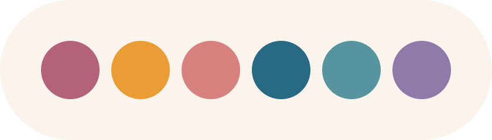

  
  <h2 align="center">Rosé Pine Theme</h2>

All natural pine, faux fur and a bit of soho vibes for the classy minimalist

  <a href="https://rosepinetheme.com/themes">Themes</a>
  ·
  <a href="https://rosepinetheme.com/palette">Palette</a>
  ·
  <a href="https://github.com/rose-pine/.github/blob/main/contributing.md">Contributing</a>

  
  
  

## Contributing

There's a plethora of surfaces out there waiting to be dipped in a lil Rosé Pine. See our [template](https://github.com/rose-pine/rose-pine-template) for more information and drop us a PR when ready over at the [Rosé Pine site repo](https://github.com/rose-pine/rose-pine-site). We can't wait to see what you create 🥰

Just here to show us some love? We 💛 social appreciation, whether it be GitHub stars, Twitter follows, or shouting to your coworkers across the office.
